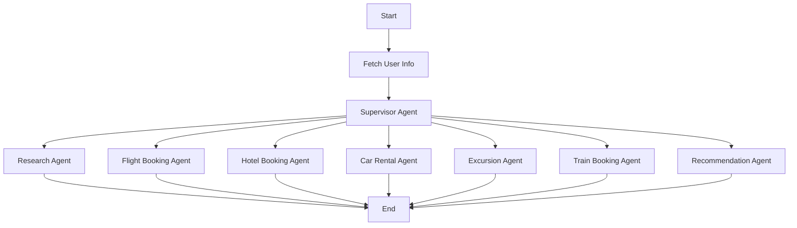

# 🚆 Trip Assistant

[](https://www.python.org/downloads/)
[](https://opensource.org/licenses/MIT)

English | [简体中文](./README_zh.md)

> AI-powered travel assistant for booking flights, trains, hotels and more

**Trip Assistant** is an intelligent travel assistant framework based on LangGraph that integrates language models with specialized tools to handle travel booking tasks such as flight reservations, train tickets, hotel bookings, and more. Our goal is to provide users with a one-stop travel planning and booking service.

## Demo

In this demo, we showcase how to use Trip Assistant to:

- Seamlessly integrate with MCP services for train booking
- Conduct the travel planning process and produce comprehensive travel itineraries
- Create booking recommendations based on user preferences

## 📑 Table of Contents

- [🚀 Quick Start](#quick-start)
- [🌟 Features](#features)
- [🏗️ Architecture](#architecture)
- [🛠️ Development](#development)
- [🗄️ Database](#database)
- [📜 License](#license)
- [💖 Acknowledgments](#acknowledgments)

## Quick Start

Trip Assistant is developed in Python. To ensure a smooth setup process, follow these steps:

### Environment Requirements

Make sure your system meets the following minimum requirements:

- **[Python](https://www.python.org/downloads/):** Version `3.10+`

### Installation

```bash
# Clone the repository
git clone <repository-url>
cd TripAssistant

# Install dependencies
pip install -r requirements.txt
```

### Configurations

```bash
# Configure .env with your API keys
cp .env.example .env

# Configure database
python db/convert_mysql_to_sqlite.py
```

### Running the Application

```bash
# Run the main application
python main.py
```

## Supported Services

### Travel Services

Trip Assistant supports multiple travel services that can be configured:

- **Flight Booking**: Flight information search and booking
- **Train Booking**: Train ticket search and booking via MCP integration
- **Hotel Booking**: Hotel search and reservation
- **Car Rental**: Car rental services
- **Excursion Booking**: Tour and activity bookings

### Private Services

Trip Assistant supports private service integration such as:

- **12306 Train Service**: China's national railway booking system via MCP
- Private hotel and car rental systems

## Features

### Core Capabilities

- 🤖 **LLM Integration**
  - Supports integration with multiple language models
  - Compatible with OpenAI API interface
  - Support for open source models

### Tools and MCP Integrations

- 🔍 **Search and Retrieval**
  - Flight information querying
  - Train ticket information querying
  - Hotel information querying
  - Support for MCP service integration

- 🔗 **MCP Seamless Integration**
  - Expand capabilities for private domain access
  - Facilitates integration of diverse travel tools and services

### Multi-Agent Architecture

- 🧠 **Intelligent Agent System**
  - Supervisor Agent: Manages the entire workflow
  - Flight Booking Agent: Handles flight reservations
  - Train Booking Agent: Handles train ticket bookings
  - Hotel Booking Agent: Manages hotel reservations
  - Car Rental Agent: Handles car rental bookings
  - Excursion Agent: Manages tour and activity bookings
  - Research Agent: Conducts research and information gathering
  - Recommendation Agent: Provides intelligent recommendations

### Human Collaboration

- 🧠 **Human-in-the-loop**
  - Supports interactive modification of travel plans using natural language
  - Supports auto-acceptance of travel plans

## Architecture

Trip Assistant implements a modular multi-agent system architecture designed for automated travel planning and booking. The system is built on LangGraph, enabling a flexible state-based workflow where components communicate through a well-defined message passing system.



The system employs a streamlined workflow with the following components:

1. **Fetch User Info**: Handles initial user requests and information collection

2. **Supervisor Agent**: The entry point that manages the workflow lifecycle
   - Initiates the travel planning process based on user input
   - Delegates tasks to specialized agents

3. **Booking Agents**: Handle specific booking tasks:
   - **Flight Booking Agent**: Flight reservations
   - **Train Booking Agent**: Train ticket bookings
   - **Hotel Booking Agent**: Hotel reservations
   - **Car Rental Agent**: Car rental services
   - **Excursion Agent**: Tour and activity bookings

4. **Support Agents**:
   - **Research Agent**: Conducts research and information gathering
   - **Recommendation Agent**: Provides intelligent recommendations

### Checkpointing

Trip Assistant utilizes LangGraph's checkpointing mechanism for state management and persistence:

#### Key Features

- **State Persistence**: Automatically saves the state of each execution step to prevent data loss from program interruptions
- **Execution Recovery**: Supports resuming from interruption points without restarting the entire process
- **Debugging Support**: Allows backtracking to any step's state for debugging and troubleshooting
- **Concurrency Control**: Ensures state isolation when multiple users are using the system simultaneously

#### How It Works

1. **State Capture**: Automatically captures and stores the current state after each node execution
2. **Snapshot Management**: Saves the complete workflow state as snapshots, including:
   - Current node information
   - All historical message records
   - Tool call results
   - User inputs and system outputs
3. **Recovery Mechanism**: When resuming execution, loads the state from the most recent snapshot and continues execution

#### Use Cases

- **Long-running Tasks**: For complex travel plans that take a long time to complete, execution can be resumed even if an unexpected interruption occurs
- **Debugging and Testing**: Developers can inspect the state at any step to improve debugging efficiency
- **User Experience Optimization**: Users can pause operations at any time and continue later without losing progress

## Database

The project uses SQLite as the local database, converted from the original MySQL data.

### Database Schema

- `t_applicationmodel`: Application model
- `t_approverecodemodel`: Approval record model
- `t_deptmodel`: Department model
- `t_menumodel`: Menu model
- `t_permissionmodel`: Permission model
- `t_role_permission`: Role-permission associations
- `t_rolemodel`: Role model
- `t_user_role`: User-role associations
- `t_usermodel`: User model

### Database Visualization

You can view the database through:

1. PyCharm Database Tool
2. sqlite-web tool:
   ```bash
   sqlite_web travel.db
   ```

## Development

### Project Structure

```
TripAssistant/
├── agents/              # Agent creation and management
├── db/                  # Database related files
├── doc/                 # Documentation
├── graph/               # LangGraph workflow definitions
├── llm/                 # Large language model integration
├── mcp/                 # MCP client integration
├── tools/               # Tool functions
├── travel.db            # SQLite database
├── travel.sql           # Original MySQL data
└── requirements.txt     # Python dependencies
```

### Adding New Agents

1. Create agent definition in `agents/` directory
2. Add node in `graph/graph_builder.py`
3. Update workflow graph definition

### Adding New Tools

1. Create tool functions in `tools/` directory
2. Integrate tools in appropriate agents

## Examples

The following examples demonstrate the capabilities of Trip Assistant:

### Travel Planning

1. **Flight Booking** - Complete flight reservation process
   - Search flights based on user criteria
   - Recommend best options
   - Complete booking process

2. **Train Ticket Booking** - Train ticket reservation via MCP
   - Query train schedules
   - Recommend suitable options
   - Complete booking via 12306 integration

3. **Hotel Reservation** - Hotel booking process
   - Search hotels based on location and preferences
   - Provide recommendations
   - Complete reservation

4. **Travel Itinerary** - Complete travel planning
   - Multi-city travel planning
   - Integrated booking of flights, hotels, and activities
   - Personalized recommendations

To run these examples:

```bash
# Run with a specific query
python main.py "Book a flight from Beijing to Shanghai"

# Run with custom planning parameters
python main.py --max_plan_iterations 3 "Plan a 3-day trip to Paris"

# Run in interactive mode
python main.py --interactive
```

### Interactive Mode

The application supports an interactive mode:

1. Launch the interactive mode:
   ```bash
   python main.py --interactive
   ```

2. Choose from a list of built-in questions or ask your own

3. The system will process your request and generate travel plans

### Human in the Loop

Trip Assistant includes a human in the loop mechanism:

1. **Plan Review**: System presents travel plan for review before execution

2. **Providing Feedback**: You can:
   - Accept the plan by responding with `[ACCEPTED]`
   - Edit the plan by providing feedback
   - The system will incorporate your feedback and generate a revised plan

3. **Auto-acceptance**: Enable auto-acceptance to skip the review process

## License

This project is open source and available under the [MIT License](./LICENSE).

## Acknowledgments

Trip Assistant is built upon the incredible work of the open-source community. We are deeply grateful to all the projects and contributors whose efforts have made this possible.

We would like to extend our sincere appreciation to the following projects for their invaluable contributions:

- **[LangChain](https://github.com/langchain-ai/langchain)**: Powers our LLM interactions and chains
- **[LangGraph](https://github.com/langchain-ai/langgraph)**: Enables our multi-agent orchestration
- **[SQLite](https://www.sqlite.org/)**: Lightweight database engine

### Key Contributors

A heartfelt thank you goes out to the core authors of `Trip Assistant`, whose vision, passion, and dedication have brought this project to life.