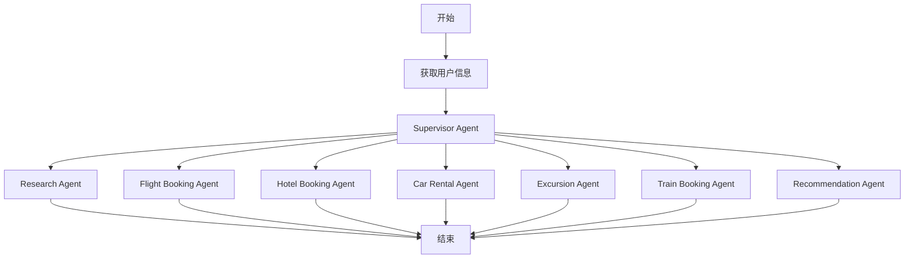

# 🚆 Trip Assistant

[](https://www.python.org/downloads/)
[](https://opensource.org/licenses/MIT)

[English](./README.md) | 简体中文

> 基于AI的旅行助手，用于预订航班、火车、酒店等

**Trip Assistant** 是一个基于 LangGraph 的智能旅行助手框架，它将语言模型与专业工具集成，处理旅行预订任务，如航班预订、火车票、酒店预订等。我们的目标是为用户提供一站式旅行规划和预订服务。

## 演示

在此演示中，我们展示了如何使用 Trip Assistant：

- 与 MCP 服务无缝集成进行火车票预订
- 进行旅行规划过程并生成全面的旅行行程
- 根据用户偏好创建预订推荐

## 📑 目录

- [🚀 快速开始](#快速开始)
- [🌟 功能](#功能)
- [🏗️ 架构](#架构)
- [🛠️ 开发](#开发)
- [🗄️ 数据库](#数据库)
- [📜 许可证](#许可证)
- [💖 致谢](#致谢)

## 快速开始

Trip Assistant 使用 Python 开发。为确保顺利设置，请按照以下步骤操作：

### 环境要求

确保您的系统满足以下最低要求：

- **[Python](https://www.python.org/downloads/):** 版本 `3.10+`

### 安装

```bash
# 克隆仓库
git clone <repository-url>
cd TripAssistant

# 安装依赖
pip install -r requirements.txt
```

### 配置

```bash
# 配置 .env 文件中的 API 密钥
cp .env.example .env

# 配置数据库
python db/convert_mysql_to_sqlite.py
```

### 运行应用程序

```bash
# 运行主应用程序
python main.py
```

## 支持的服务

### 旅行服务

Trip Assistant 支持多种可配置的旅行服务：

- **航班预订**: 航班信息搜索和预订
- **火车票预订**: 通过 MCP 集成搜索和预订火车票
- **酒店预订**: 酒店搜索和预订
- **租车服务**: 汽车租赁服务
- **游览预订**: 旅游和活动预订

### 私人服务

Trip Assistant 支持私人服务集成，例如：

- **12306 火车服务**: 通过 MCP 集成中国铁路预订系统
- 私人酒店和租车系统

## 功能

### 核心功能

- 🤖 **LLM 集成**
  - 支持与多种语言模型集成
  - 兼容 OpenAI API 接口
  - 支持开源模型

### 工具和 MCP 集成

- 🔍 **搜索和检索**
  - 航班信息查询
  - 火车票信息查询
  - 酒店信息查询
  - 支持 MCP 服务集成

- 🔗 **MCP 无缝集成**
  - 扩展私域访问能力
  - 促进多样化旅行工具和服务的集成

### 多代理架构

- 🧠 **智能代理系统**
  - Supervisor Agent: 管理整个工作流程
  - Flight Booking Agent: 处理航班预订
  - Train Booking Agent: 处理火车票预订
  - Hotel Booking Agent: 管理酒店预订
  - Car Rental Agent: 处理租车预订
  - Excursion Agent: 管理旅游和活动预订
  - Research Agent: 进行研究和信息收集
  - Recommendation Agent: 提供智能推荐

### 人机协作

- 🧠 **人在回路**
  - 支持使用自然语言交互修改旅行计划
  - 支持自动接受旅行计划

## 架构

Trip Assistant 实现了模块化多代理系统架构，专为自动化旅行规划和预订而设计。该系统基于 LangGraph 构建，支持灵活的基于状态的工作流，组件通过明确定义的消息传递系统进行通信。



该系统采用简化的工工作流，包含以下组件：

1. **获取用户信息**: 处理初始用户请求和信息收集

2. **Supervisor Agent**: 管理工作流生命周期的入口点
   - 根据用户输入启动旅行规划过程
   - 将任务委派给专业代理

3. **预订代理**: 处理特定的预订任务：
   - **Flight Booking Agent**: 航班预订
   - **Train Booking Agent**: 火车票预订
   - **Hotel Booking Agent**: 酒店预订
   - **Car Rental Agent**: 汽车租赁服务
   - **Excursion Agent**: 旅游和活动预订

4. **支持代理**：
   - **Research Agent**: 进行研究和信息收集
   - **Recommendation Agent**: 提供智能推荐

### 检查点机制

Trip Assistant 利用 LangGraph 的检查点机制进行状态管理和持久化：

#### 主要特性

- **状态持久化**: 自动保存每个执行步骤的状态，防止程序中断导致的数据丢失
- **执行恢复**: 支持从中断点恢复，无需重新启动整个过程
- **调试支持**: 允许回溯到任何步骤的状态进行调试和故障排除
- **并发控制**: 确保多个用户同时使用系统时的状态隔离

#### 工作原理

1. **状态捕获**: 在每次节点执行后自动捕获并存储当前状态
2. **快照管理**: 将完整的工作流状态保存为快照，包括：
   - 当前节点信息
   - 所有历史消息记录
   - 工具调用结果
   - 用户输入和系统输出
3. **恢复机制**: 恢复执行时，从最近的快照加载状态并继续执行

#### 使用场景

- **长时间运行的任务**: 对于需要较长时间完成的复杂旅行计划，即使发生意外中断也可以恢复执行
- **调试和测试**: 开发人员可以检查任何步骤的状态以提高调试效率
- **用户体验优化**: 用户可以随时暂停操作，稍后继续而不会丢失进度

## 数据库

该项目使用 SQLite 作为本地数据库，从原始的 MySQL 数据转换而来。

### 数据库模式

- `t_applicationmodel`: 应用模型
- `t_approverecodemodel`: 审批记录模型
- `t_deptmodel`: 部门模型
- `t_menumodel`: 菜单模型
- `t_permissionmodel`: 权限模型
- `t_role_permission`: 角色权限关联
- `t_rolemodel`: 角色模型
- `t_user_role`: 用户角色关联
- `t_usermodel`: 用户模型

### 数据库可视化

您可以通过以下方式查看数据库：

1. PyCharm 数据库工具
2. sqlite-web 工具：
   ```bash
   sqlite_web travel.db
   ```

## 开发

### 项目结构

```
TripAssistant/
├── agents/              # 代理创建和管理
├── db/                  # 数据库相关文件
├── doc/                 # 文档
├── graph/               # LangGraph 工作流定义
├── llm/                 # 大语言模型集成
├── mcp/                 # MCP 客户端集成
├── tools/               # 工具函数
├── travel.db            # SQLite 数据库
├── travel.sql           # 原始 MySQL 数据
└── requirements.txt     # Python 依赖
```

### 添加新代理

1. 在 `agents/` 目录中创建代理定义
2. 在 `graph/graph_builder.py` 中添加节点
3. 更新工作流图定义

### 添加新工具

1. 在 `tools/` 目录中创建工具函数
2. 在适当的代理中集成工具

## 示例

以下示例演示了 Trip Assistant 的功能：

### 旅行规划

1. **航班预订** - 完整的航班预订流程
   - 根据用户条件搜索航班
   - 推荐最佳选项
   - 完成预订过程

2. **火车票预订** - 通过 MCP 预订火车票
   - 查询火车时刻表
   - 推荐合适的选项
   - 通过 12306 集成完成预订

3. **酒店预订** - 酒店预订流程
   - 根据位置和偏好搜索酒店
   - 提供推荐
   - 完成预订

4. **旅行行程** - 完整的旅行规划
   - 多城市旅行规划
   - 航班、酒店和活动的集成预订
   - 个性化推荐

运行这些示例：

```bash
# 使用特定查询运行
python main.py "预订从北京到上海的航班"

# 使用自定义规划参数运行
python main.py --max_plan_iterations 3 "规划巴黎3日游"

# 在交互模式下运行
python main.py --interactive
```

### 交互模式

应用程序支持交互模式：

1. 启动交互模式：
   ```bash
   python main.py --interactive
   ```

2. 从内置问题列表中选择或提出自己的问题

3. 系统将处理您的请求并生成旅行计划

### 人在回路

Trip Assistant 包含人在回路机制：

1. **计划审查**: 系统在执行前展示旅行计划供审查

2. **提供反馈**: 您可以：
   - 通过回复 `[ACCEPTED]` 接受计划
   - 通过提供反馈编辑计划
   - 系统将整合您的反馈并生成修订计划

3. **自动接受**: 启用自动接受以跳过审查过程

## 许可证

该项目是开源的，可在 [MIT 许可证](./LICENSE) 下获得。

## 致谢

Trip Assistant 建立在开源社区的杰出工作之上。我们深深感谢所有为该项目做出贡献的项目和贡献者。

我们要向以下项目致以诚挚的谢意，感谢他们宝贵的贡献：

- **[LangChain](https://github.com/langchain-ai/langchain)**: 为我们的 LLM 交互和链提供支持
- **[LangGraph](https://github.com/langchain-ai/langgraph)**: 使我们的多代理编排成为可能
- **[SQLite](https://www.sqlite.org/)**: 轻量级数据库引擎

### 主要贡献者

向 `Trip Assistant` 的核心作者致以衷心的感谢，他们的愿景、热情和奉献精神使这个项目得以实现。